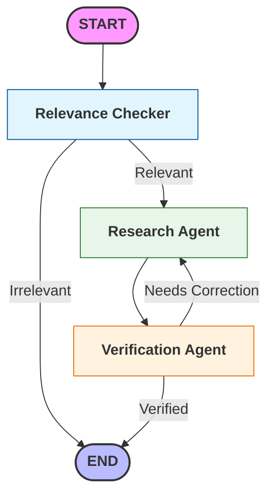

# DocChat: Serverless Agentic RAG with Docling & LangGraph 🐥

> **A "Serverless-First" document analysis agent that uses advanced layout-aware parsing (Docling) and graph-based orchestration (LangGraph) to perform deep research on complex technical reports.**

[](https://modal.com)
[](https://github.com/DS4SD/docling)
[](https://langchain-ai.github.io/langgraph/)
[](https://www.python.org/)
[](https://www.trychroma.com/)
[](https://ai.google.dev/)
[](https://ai.google.dev/models/embeddings)
[](https://en.wikipedia.org/wiki/Stoicism)
[](https://en.wikipedia.org/wiki/Data_science)
[](https://en.wikipedia.org/wiki/Statistics)

---

## 🧠 Architecture

This project is not just a wrapper around OpenAI. It is a full-stack engineering demonstration of how to build, optimize, and deploy a heavy computer-vision RAG pipeline on serverless infrastructure. Most RAG applications are simple linear pipelines. This project implements a **Multi-Agent Workflow** using **LangGraph** to ensure technical accuracy and eliminate hallucinations—a critical requirement for auditing technical or financial data.

### The Core Pipeline
1.  **Ingestion (The "Vision" Layer):** Uses **Docling** to render PDFs as images first, then extracts text with layout awareness. This prevents the common "headers merging with body text" issue found in standard PyPDF parsing.
2.  **Orchestration (The "Brain"):** A **LangGraph** state machine that doesn't just "retrieve and generate." It:
    * **Intelligent Gatekeeping:** Every query is first passed through a Relevance Checker. This prevents "hallucinations by force" by terminating queries that aren't supported by the uploaded documents.
    * **Ensemble Retrieval:** The Research Agent utilizes an `EnsembleRetriever` to pull context from multiple vector sources, synthesizing high-fidelity draft answers
    * **The Audit Loop (Self-Correction):** Inspired by rigorous data audit standards, the Verification Agent critiques the research output. If an answer is unsupported or incomplete, it triggers a re_research loop to refine the response before the user ever sees it.
3.  **Infrastructure (The "Metal"):** Deployed on **Modal**, utilizing:
    * **Serverless GPUs (L4)** for OCR and Embeddings.
    * **Custom Container Images** with pinned Linux system libraries (`libGL`, `fonts-liberation`).
    * **Concurrency Management** to handle multiple users without burning GPU credits.  

<br>

#### Visual representation of workflow:


---

## ⚖️ Deployment & Performance
This application is deployed using a **Serverless Architecture (Modal)**.

- **Cost Efficiency:** To minimize overhead, the infrastructure remains at zero when not in use. You are only billed for the exact seconds the code is running.

- **The "Cold Start" Trade-off:** Upon the first request, the environment takes ~30-60 seconds to spin up the container and load the LLM/Vector index into memory. Subsequent requests are sub-second.

- **Why this approach?** For a portfolio project, this demonstrates the ability to deploy production-grade AI without the high monthly cost of an "always-on" GPU server.


---

## 🚀 Live Demo
**Try the app here:** [DocChat Demo](https://estevanfisk.com/projects/document_summary_llm/demo/)

*(Note: The app runs on a cold-start architecture to save costs. Please allow 30-60 seconds for the first request as the container spins up.)*

---

## 🛠️ Tech Stack & Engineering Decisions

| Component | Technology | Why I Chose It |
| :--- | :--- | :--- |
| **Parsing** | **Docling** (IBM) | Standard parsers struggle with complex, multi-column PDFs. Docling uses computer vision to preserve layout and structural integrity during extraction. |
| **Agents** | **LangGraph** | Standard chains are too linear. LangGraph enables stateful, cyclical workflows—allowing for an "Audit Loop" where a Verifier agent can trigger a re-research phase if accuracy is low. |
| **LLMs** | **Gemini 1.5 Flash & GPT-4o-mini** | A dual-model approach balances the high-speed reasoning of Gemini with the precise verification capabilities of GPT-4o-mini to minimize hallucinations. |
| **Vector DB** | **ChromaDB** | High-performance, ephemeral storage that allows for rapid, persistent indexing of uploaded documents within a serverless environment. |
| **Embeddings** | **Google Gemini (`text-embedding-004`)** | Utilizes state-of-the-art semantic representation specifically optimized for retrieval tasks, replacing legacy embedding models for better accuracy. |
| **Retriever** | **Hybrid Ensemble** | Combines **BM25** (keyword matching) with **Chroma** (semantic meaning) via an `EnsembleRetriever` to ensure the agent finds exact data points regardless of phrasing. |
| **Compute** | **Modal** | Avoids the overhead of AWS/GCP by defining infrastructure as code (IaC). Serverless billing by the second is ideal for managing cost-to-latency trade-offs. |
| **UI** | **Gradio (Pinned)** | A rapid-prototyping interface pinned to v5.16+ to maintain compatibility and handle specific Pydantic serialization requirements. |
| **OCR** | **RapidOCR** | A lightweight ONNX-based OCR that runs efficiently on CPU/Low-tier GPU for documents where standard vector font extraction fails. |
---

## ⚡ Challenges & Solutions

### 1. The "Linux Slim" Font Problem
**Challenge:** The app worked perfectly on Windows but produced "gibberish" tokens on Modal.
**Root Cause:** The `debian-slim` container lacks standard fonts. Docling couldn't render the PDF text layer and fell back to OCR, which failed without fonts.
**Solution:** Custom image build step installing `fonts-liberation` and `libgl1` at the OS level.
```python
# modal_app.py
image = modal.Image.debian_slim().apt_install("libgl1", "fonts-liberation")
```


### 2. "Dependency Hell" (Pydantic vs. Gradio)
**Challenge:** `Docling` requires Pydantic v2.10+ (for strict schemas), but `Gradio` crashed when receiving boolean schema types from that version.
**Solution:** Pinned Pydantic to `<2.10` to maintain stability while allowing Gradio to function, illustrating the trade-off between "bleeding edge" features and stability.

---

## 💻 Local Setup

If you want to run this on your own machine (requires NVIDIA GPU recommended):

1. **Clone the repo**
   ```bash
   git clone [https://github.com/YOUR_USERNAME/docchat-portfolio.git](https://github.com/YOUR_USERNAME/docchat-portfolio.git)
   cd docchat-portfolio
   ```

2. **Set up environment**
   ```bash
   conda create -n docchat python=3.12
   pip install -r requirements.txt
   ```


3. **Set API Keys**
   Create a `.env` file in the root directory:
   ```bash
   GOOGLE_API_KEY=your_key_here
   OPENAI_API_KEY=your_key_here
   ```

4. **Run**
   ```bash
   python gradio_app.py
   ```

## ☁️ Deployment (Modal)

To deploy your own instance to the cloud:

1. **Install Modal**
   ```bash
   pip install modal
   modal setup
   ```

2. **Deploy**
   ```bash
   modal deploy modal_app.py
   ```


